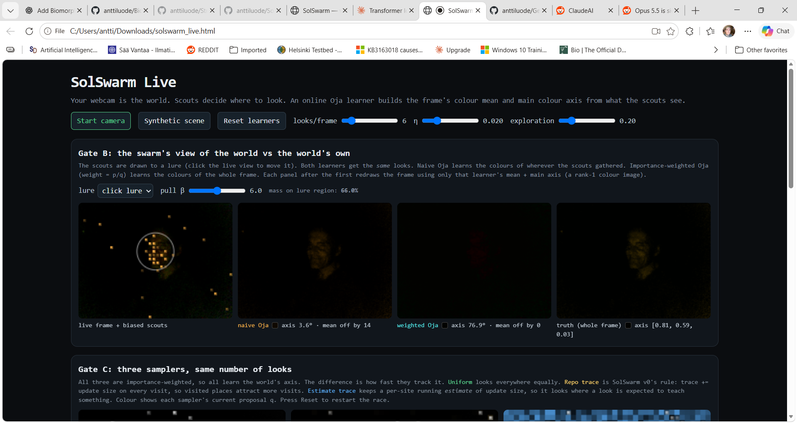

# SolSwarm

Demo by Claude: 

[Check it out!](https://anttiluode.github.io/SolSwarm/)



**Can a world remember what happened strongly enough that a linear operator reveals what the population is becoming before the population visibly gets there?**

SolSwarm is a deliberately small falsifier built from four familiar ingredients:

- **stigmergy:** persistent local traces alter later opportunities;
- **positive-operator dynamics:** a population evolves by normalized multiplication;
- **importance sampling:** nonuniform scouts are corrected back to the intended world distribution;
- **Oja's rule:** an online stochastic eigensolver extracts a dominant mode from the stream.

The point is not to claim a new swarm optimizer. The point is to separate what actually survives measurement.

## Gate A — the world writes the future operator

A ten-state toy world has two route families, A and B. Persistent trace `s` modifies a positive operator

$$
L(s)=M\,\mathrm{diag}(\exp(b+\alpha s)),
\qquad
q_{t+1}=\frac{L(s)q_t}{\mathbf 1^\top L(s)q_t}.
$$

Two counterfactual worlds start from the **same population** and receive the **same total trace** in B. The only difference is the address of that write.

Committed receipt:

| matched write | B/A spectral growth | B mass after 20 steps |
|---|---:|---:|
| B hub | **1.0723** | **0.6558** |
| B leaf | **0.9749** | **0.4346** |

At the fork, B mass is `0.5` in both worlds. The spectral ordering has already changed before the visible population separates.

This address sensitivity is not a new spectral law. It is the standard Perron eigenvalue-sensitivity / elasticity result used in structured population models. If `u` and `v` are the left and right Perron eigenvectors of one positive block, then for this parameterization

$$
\frac{\partial \log \lambda}{\partial s_i}
=\alpha\,\frac{u_i v_i}{u^\top v}.
$$

For `log(rho_B/rho_A)`, A-site elasticities enter with a minus sign and B-site elasticities with a plus sign. At zero trace, the exact B-hub susceptibility is `0.94736842` and each B leaf is `0.26315789`; the five B elasticities sum to `alpha = 2`. The analytical values agree with the original finite-difference calculation to a maximum absolute error of about `5.3e-7`.

So Gate A is best read as a visible stigmergic instance of known positive-matrix sensitivity: **where history is written matters because left-listener and right-sender weights multiply.**

There is an important limitation. v0 is handed the operator `L(s)` and reads its spectrum directly. It does **not** yet show that scouts observing a noisy trajectory can estimate the impending spectral flip before ordinary state variables reveal it. That is the sharper next question.

## Gate B — biased scouts do not have to bias the learned mode

The second control has eight sites with 2-D feature vectors. Under the real world distribution `p` (uniform), the batch principal direction is approximately

```text
[0.9814, 0.1921]
```

A deliberately misleading "error" field makes scouts sample from `q`, placing **83.2%** of their visits on two high-error vertical sites.

Naive Oja therefore learns the **proposal's** mode, not the world's mode.

Importance-weighted Oja uses

$$
w_i=\frac{p_i}{q_i}
$$

inside the update. Across 32 deterministic seeds and 3,000 observations:

| estimator | median angle from true world PC |
|---|---:|
| naive biased Oja | **74.37°** |
| importance-weighted Oja | **2.25°** |

The worst weighted run is `5.97°`.

This gate is a correctness check for a known identity rather than a new theorem:

$$
\mathbb E_{x\sim q}\!\left[\frac{p(x)}{q(x)}zz^\top\right]
=\mathbb E_{x\sim p}[zz^\top].
$$

The useful bridge is practical: scouts may look nonuniformly while an importance-corrected online eigensolver still estimates the mode of the intended world distribution.

## Gate C — the original trace rule was the wrong utility signal

The v0 adaptive rule did this after every visit:

```text
trace *= decay
trace[i] += ||raw Oja update at i||
```

That quantity is **visit frequency × update magnitude**. A site that gets sampled more often builds more trace merely because it was visited, which attracts still more visits. The v0 negative result therefore diagnoses this accumulating rule, not adaptive sampling in general.

The corrected control keeps a per-site running estimate of update magnitude instead. Scouts use a proposal proportional to

$$
q_i \propto p_i\,\widehat{\lVert g_i\rVert}
$$

mixed with 20% target-distribution exploration, and every Oja update is still corrected by `p_i/q_i`. A privileged oracle recomputes all current `||g_i(w)||` values before every look; it is a reference, not a deployable sampler.

At 200 observations across the same 64 deterministic seeds:

| sampler | median angle | beats paired uniform seed |
|---|---:|---:|
| uniform | **3.25°** | — |
| v0 accumulating trace + importance correction | **7.49°** | **29.7%** |
| v0 accumulating trace, naive | **17.44°** | — |
| per-site estimated utility + importance correction | **2.83°** | **56.25%** |
| privileged current-gradient oracle + importance correction | **2.52°** | **56.25%** |

So the conclusion changes:

> **importance correction fixes bias; useful adaptive sampling additionally needs a proposal that estimates per-site value rather than accumulating visits.**

On this small toy, that corrected proposal gives a **modest median advantage** over uniform sampling. The seed-wise win rate is only 56.25%, so this is not evidence for universal adaptive-sampling superiority. The original failed accumulator remains in the code and receipt as a control.

This also sharpens the BiomorphicSwarm lesson. "Look where error is high" and "look where another observation has high expected update value" are different policies. Error, sampling bias, reducible learning progress and gradient leverage should not be collapsed into one quantity.

## What this connects

SolSwarm's operator branch is now explicitly standard positive-matrix perturbation theory:

$$
\text{local history}
\rightarrow
s
\rightarrow
L(s)
\rightarrow
u_i v_i\text{ / Perron elasticity}
\rightarrow
\text{later macroscopic population}.
$$

Its sampling branch is:

$$
x_t\sim q_t
\rightarrow
\frac{p(x_t)}{q_t(x_t)}\,\text{evidence}
\rightarrow
\text{Oja mode estimate}.
$$

The next synthesis is the part v0 does **not** contain:

> can noisy, biased scouts estimate the relevant left/right Perron structure from observations early enough to predict a mode flip without being handed `L`?

That would join Gate A's listener/sender sensitivity to Gate B's corrected observation stream instead of placing two known results side by side.

## Run

```bash
python -m venv .venv
# activate it
pip install -e ".[test]"
python experiments/run_all.py
pytest
```

The deterministic receipt is committed at [`receipts/latest.json`](receipts/latest.json).

The repository root contains the dependency-free live `index.html` demo for GitHub Pages. On the published HTTPS page, camera access can run directly in browsers that grant permission; frames stay in the browser.

## Layout

```text
src/solswarm/operator.py   world-written positive operator + Perron elasticity
src/solswarm/oja.py        biased scouts + importance-weighted Oja
src/solswarm/adaptive.py   failed accumulator + utility estimator + oracle control
experiments/run_all.py     regenerate authoritative receipts
receipts/latest.json       frozen deterministic numbers
index.html                 live visual demo
tests/                     scientific invariants and claim boundaries
```

## Claim boundary

SolSwarm does **not** establish new physics, biological equivalence, optimal active sensing, universal swarm superiority, a new PCA algorithm, or a new eigenvalue-sensitivity formula. Positive operators, Perron sensitivity/elasticity, importance sampling, Oja/PCA, diffusion-like exploration, and stigmergy all have established literatures. The experiment is about putting them in one falsifiable loop, showing them visually, and keeping the boundaries between them explicit.

## Pointers

- E. Oja, *Simplified neuron model as a principal component analyzer*, Journal of Mathematical Biology 15 (1982).
- A. Katharopoulos & F. Fleuret, *Not All Samples Are Created Equal: Deep Learning with Importance Sampling*, ICML 2018.
- H. Caswell, *Matrix Population Models: Construction, Analysis, and Interpretation*, 2nd ed. (2001), for sensitivity and elasticity analysis of positive population projection matrices.
- S. Pal, F. Y. Wang & M. J. Buehler, *SwarmWorld: Stigmergic technological evolution in societies of language-model agents*, arXiv:2608.26081 (2026).
